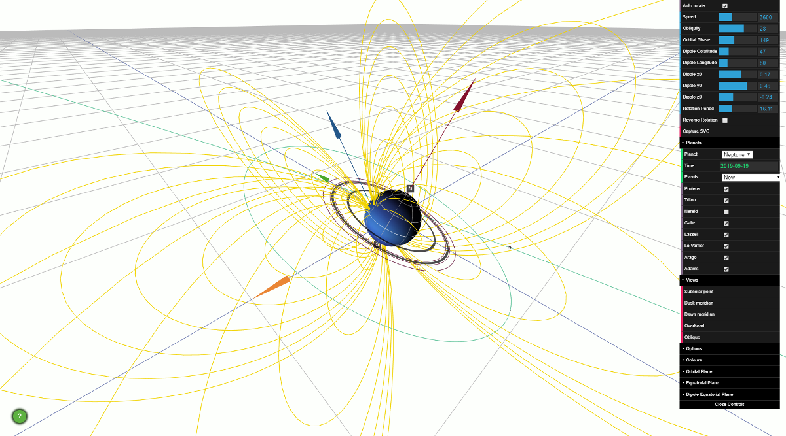

# Ikuchi - Simple Magnetosphere Viewer #
**Author: [Chris Arridge](https://www.lancaster.ac.uk/physics/about-us/people/chris-arridge), Lancaster University, c.arridge@lancaster.ac.uk**

`Ikuchi` is an HTML/Javascript application which uses [Three.JS](https://threejs.org/) to render 3D views of solar system magnetospheres. It is designed for quickly viewing the realistic 3D and time-dependent geometry of giant planet magnetospheres, particularly Uranus and Neptune. The scenes are viewed in a coordinate system with one axis pointing from the planet towards the Sun, and another pointing from the planet in the direction of its orbital motion. You may know this as a "Planetary Solar Orbital" coordinate system, e.g., Geocentric Solar Ecliptic (GSE) at Earth, or Kronocentric Solar Orbital (KSO) at Saturn. The orientation of the planets as a function of time is computed from non-linear functions fitted to data from NASA/JPL [Navigation and Ancillary Information Facility (NAIF)](https://naif.jpl.nasa.gov/naif/)'s [SPICE](https://naif.jpl.nasa.gov/naif/spiceconcept.html) system. The RMS errors associated with fitting to SPICE data are no larger than 0.06 deg, and most planets have a maximum errors no larger than around 0.03 degrees, apart from Jupiter and Saturn, which have maximum errors of around 0.2 degrees. Texture maps come from 'http://planetpixelemporium.com/planets.html' and are copyright James Hastings-Trew.

## Installation
Just copy the `Ikuchi` `source` folder somewhere on your machine. The folder can be renamed. The `Ikuchi.html` file must be in the same location as the `js` and `css` folders.

## Usage
By default, `Ikuchi` loads with a view of the dusk terminator showing a pseudo noon-midnight meridian view. The planet has zero obliquity (no seasons), a 10 degree dipole tilt, and a rotation period of 24 hours.

The planet is rendered with a latitude-longitude grid, with the prime meridian and equator highlighted. The yellow lines are field lines. Four vectors show:
* Red: a vector from the centre of the planet to the Sun.
* Blue: the rotation axis of the planet.
* White: the dipole axis.
* Green: The orbital velocity vector of the planet.

Hence, the red and green vectors identify the orbital plane of the planet, which is shown as a wire mesh. The equatorial plane of the planet is highlighted in a semi-transparent green circle. The mouse can be used to manipulate the scene:
* Left-clicking and moving the mouse-pointer shifts the observer's view.
* Right-clicking and moving the mouse-pointer shifts the observer's location.
* The mouse wheel zooms in and out.

Specific views can be specified by expanding the "Views" panel and clicking one of the options.

The GUI at the top right offers a range of options. By default the planet auto-rotates at the specified rotation period. This behaviour can be turned off by deselecting "Auto rotate planet". The rotation period can be changed at the bottom of this set of options with "Rotation Period", by either typing in a new number, or dragging the blue bar. By default one second of real time represents 3600 seconds (1 hour) of simulation time, so that the planet rotates once every 24 seconds. This can be changed through the "Speed" setting. Changing to smaller values with slow the simulation down towards real-time, increasing will speed up the simulation.

Obliquity and Orbital Phase define the orientation of the planetary system. Obliquity changes the axial tilt of the planet, relative to the orbital plane, and orbital phase changes the position of the planet in it's orbit around the Sun. These values can be modified to adjust the orientation to suit, but specific planets can be automatically setup in the "Planets" panel. Click to open this up. Select a planet and press "Go" and you will see the planet configuration at the current time (this will automatically change the obliquity, orbital phase, dipole properties and rotation period). You can change the time with the "Time" widget; the time must be in the format YYYY-MM-DD. For each planet, a range of settings are also included under "Events". Selecting an event will automatically set up this scene (pressing "Go" is not required).

The dipole magnetic field can be adjusted with the three parameters in the main panel; they set the colatitude of the magnetic pole ("Dipole Colatitude"), the longitude of the magnetic pole ("Dipole Longitude") and the centre of the dipole ("Dipole Centre"). For example, Saturn's dipole has an offset of 0.04 planetary radii to the north, hence the centre would be (0.0,0.0,0.04). Note that this field must be set in the format (x0,y0,z0) including the brackets.

## Rebuilding
`Ikuchi` requires no specific build process out of the box, but if you wish to change the time-period that `Ikuchi` has been setup for, or if you wish to use alternative textures, then you will need to use the `build.py` script in `source/build/`. This will build the 'ikuchi-pregenerated.js' file and will place it in `source/js/`. The build script requires `numpy`, `scipy`, `spiceypy` (https://github.com/AndrewAnnex/SpiceyPy), and optionally `matplotlib`.

## Future work
Features that are being developed are:
* Customise the colours/look of various vectors.
* Render natural satellites and planetary rings (including being able to select subsets to render).
* Add magnetopause and bow shock models.
* Add custom magnetic field models (e.g., traces from 'geopack' and spherical harmonic internal field models).
* Modify planets so that they are biaxial ellipsoids to account for the polar flattening of the giant planets.
* Colour surface by field strength.
* Add magnetic equator to planet surface.
* Add current sheet surfaces?
* Add aurora rendering.
* Add time series widget to show dipole-Sun vector attack angle.
* Add aberrated solar wind angle vector.
