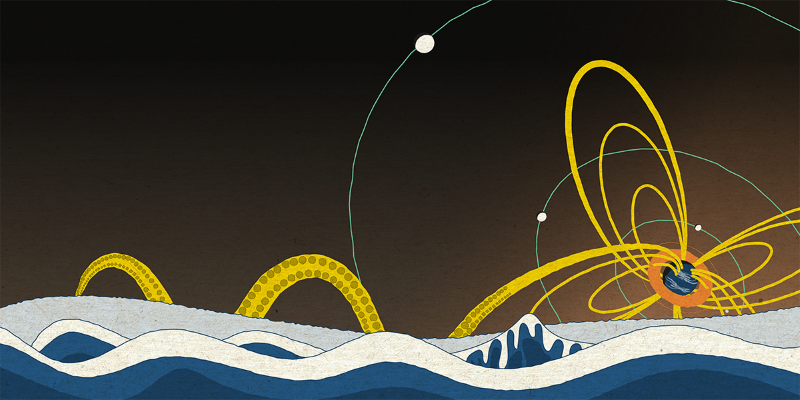
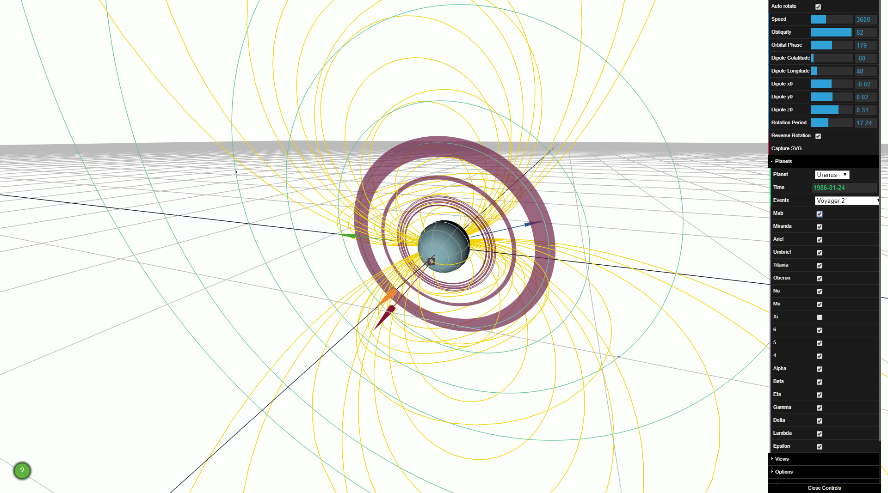

# Ikuchi - Simple Magnetosphere Viewer #
**Contributors: [Chris Arridge](https://www.lancaster.ac.uk/physics/about-us/people/chris-arridge), Lancaster University, c.arridge@lancaster.ac.uk; [Josh Wiggs](https://www.lancaster.ac.uk/physics/about-us/people/josh-wiggs), Lancaster University, j.wiggs@lancaster.ac.uk**

`Ikuchi` is an HTML/Javascript application which uses [Three.JS](https://threejs.org/) to render 3D views of solar system magnetospheres. It is designed for quickly viewing the realistic 3D and time-dependent geometry of giant planet magnetospheres, particularly Uranus and Neptune. The scenes are viewed in a coordinate system with one axis pointing from the planet towards the Sun, and another pointing from the planet in the direction of its orbital motion. You may know this as a "Planetary Solar Orbital" coordinate system, e.g., Geocentric Solar Ecliptic (GSE) at Earth, or Kronocentric Solar Orbital (KSO) at Saturn. The orientation of the planets as a function of time is computed from non-linear functions fitted to data from NASA/JPL [Navigation and Ancillary Information Facility (NAIF)](https://naif.jpl.nasa.gov/naif/)'s [SPICE](https://naif.jpl.nasa.gov/naif/spiceconcept.html) system. The RMS errors associated with fitting to SPICE data are no larger than 0.06 deg, and most planets have a maximum errors no larger than around 0.03 degrees, apart from Jupiter and Saturn, which have maximum errors of around 0.2 degrees. Although the fits are generally very accurate, `Ikuchi` is not designed for accurate ephemeris. The orbits of natural satellites are especially simplified.

## Origins of the name `Ikuchi`
Ikuchi refers to a [supernatural sea creature](https://en.wikipedia.org/wiki/Ikuchi) from [Japanese legend](https://en.wikipedia.org/wiki/Y%C5%8Dkai). In some depictions it appears as a sort of Kraken with tentacles that it uses to envelop passing ships. The tentacles here reminded one of us of field lines in a very asymmetrical magnetosphere, hence the name of the tool.

## Installation
Just copy the `Ikuchi` `source` folder somewhere on your machine. The folder can be renamed. The `Ikuchi.html` file must be in the same location as the `js` and `css` folders.

## Licence
Copyright (C) 2019-2020 Chris Arridge, Josh Wiggs and Lancaster University

This program is free software: you can redistribute it and/or modify it under
the terms of the GNU General Public License as published by the Free Software
Foundation, either version 3 of the License, or (at your option) any later version.

This program is distributed in the hope that it will be useful,
but WITHOUT ANY WARRANTY; without even the implied warranty of
MERCHANTABILITY or FITNESS FOR A PARTICULAR PURPOSE.  See the
GNU General Public License for more details.

You should have received a copy of the GNU General Public License
along with this program.  If not, see <https://www.gnu.org/licenses/>.

## Other credits
Texture maps for Earth, Jupiter, Saturn, Uranus and Neptune come from [Planet Pixel Emporium](http://planetpixelemporium.com/planets.html) and are copyright [James Hastings-Trew](https://twitter.com/jamesht?lang=en).

The Ikuchi artwork above uses a texture by [efe_madrid](https://www.freepik.com/efe-madrid) that the author kindly made freely available on [Freepik](https://www.freepik.com) The artwork itself was inspired by the works of <a href="https://en.wikipedia.org/wiki/Toriyama_Sekien">Sano Toyofusa</a> and <a href="https://en.wikipedia.org/wiki/Hokusai">Katsushika Hokusai</a>.

## Usage
### Basic
By default, `Ikuchi` loads with a view of the dusk terminator showing a pseudo noon-midnight meridian view. The planet has zero obliquity (no seasons), a 10 degree dipole tilt, and a rotation period of 24 hours:

The planet is rendered with a latitude-longitude grid, with the prime meridian and equator highlighted. The yellow lines are field lines. Four vectors show:
* Orange: a vector from the centre of the planet to the Sun.
* Crimson: the rotation axis of the planet.
* Blue: the dipole axis.
* Green: The orbital velocity vector of the planet.

Hence, the orange and green vectors identify the orbital plane of the planet, which is shown as a wire mesh by default. The equatorial plane of the planet is not visible in the default view, although this can be changed in the settings. The mouse can be used to manipulate the scene:
* Left-clicking and moving the mouse-pointer shifts the observer's view.
* Right-clicking and moving the mouse-pointer shifts the observer's location.
* The mouse wheel zooms in and out.

### GUI Controls
The GUI at the top right offers a range of options. For example, instead of using the mouse to move around the planet, the `Views` tab contains five pre-set views. The options panel also allows the user to swap between `perspective` and `orthographic` views. If you want to view the system in an isometric projection, change the camera to `orthographic` and select the `oblique` view.

By default the planet auto-rotates at the specified rotation period. This behaviour can be turned off by deselecting "Auto rotate planet". The rotation period can be changed at the bottom of this set of options with "Rotation Period", by either typing in a new number, or dragging the blue bar. By default one second of real time represents 3600 seconds (1 hour) of simulation time, so that the planet rotates once every 24 seconds. This can be changed through the "Speed" setting. Changing to smaller values with slow the simulation down towards real-time, increasing will speed up the simulation.

Obliquity and Orbital Phase define the orientation of the planetary system. Obliquity changes the axial tilt of the planet, relative to the orbital plane, and orbital phase changes the position of the planet in it's orbit around the Sun. The dipole magnetic field can be adjusted with the five parameters in the main panel; they set the colatitude of the magnetic pole ("Dipole Colatitude"), the longitude of the magnetic pole ("Dipole Longitude") and the centre of the dipole ("Dipole Centre"). For example, Saturn's dipole has an offset of 0.04 planetary radii to the north, hence the centre would be 0.0 in the `x0` and `y0` widgets, and `0.04` in the `z0` widget.

Whilst these values can be adjusted in the GUI, specific planets and times can be set in the `Planets` panel. Click to open this up. Select a planet in the combobox and the configuration will automatically update to the current time. New widgets will also appear in the GUI to allow the user to show/hide different satellites/rings. The time can be changed in the `Time` widget; the time must be in the format YYYY-MM-DD. For each planet, a range of settings are also included under "Events". Selecting an event will automatically set up this scene. For example, the configuration of Neptune during the Voyager 2 flyby can be selected:

### Definitions
The unique orientation of Uranus can cause some difficulty in how the poles and rotation axis are defined. `Ikuchi` uses the IAU definition of a planet's north pole as the pole which lies is the same celestial hemisphere as Earth's north pole [e.g., [Archinal, B.A., et al., (2011) Celestial Mechanics and Dynamical Astronomy, 109(2), pp.101-135](https://link.springer.com/article/10.1007%2Fs10569-010-9320-4), and [Wikipedia](https://en.wikipedia.org/wiki/Poles_of_astronomical_bodies)]. According to this definition Uranus is a retrograde rotator and during the Voyager 2 encounter the south pole and the rotational pole were almost facing the Sun.

### Customisation
The GUI controls include a number of customisation controls that allow the user to modify the colour scheme, opacity, the look of the orbital plane, and to enable and customise views of the equatorial and dipole equatorial planes.

## Rebuilding
`Ikuchi` requires no specific build process out of the box, but if you wish to change the time-period that `Ikuchi` has been setup for, or if you wish to use alternative textures, then you will need to use the `build.py` script in `source/build/`. This will build the 'ikuchi-pregenerated.js' file and will place it in `source/js/`. The build script requires `numpy`, `scipy`, `spiceypy` (https://github.com/AndrewAnnex/SpiceyPy), and optionally `matplotlib`. It also requires the appropriate textures from [Planet Pixel Emporium](http://planetpixelemporium.com/planets.html). The user might wish to use higher resolution textures; the supplied build uses the 1k textures from Planet Pixel Emporium.

## Future work
Features that are being developed are:
* Modify planets so that they are biaxial ellipsoids to account for the polar flattening of the giant planets.
* Colour surface by field strength.
* Add magnetic equator to planet surface.
* Add magnetopause and bow shock models.
* Add custom magnetic field models (e.g., traces from 'geopack' and spherical harmonic internal field models).
* Add current sheet surfaces.
* Add aurora rendering.
* Add time series widget to show dipole-Sun vector attack angle.
* Add aberrated solar wind angle vector.
* Compute geomagnetic field from IGRF with time.
* Add more accurate natural satellite orbits.
* Add option to switch between IAU and non-IAU definitions of planetary poles.
* Add Mercury, Venus and Mars.
